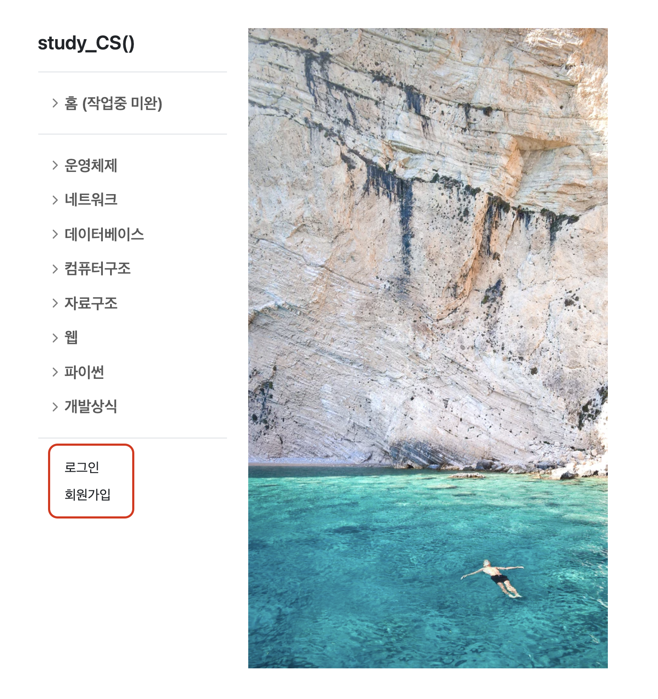
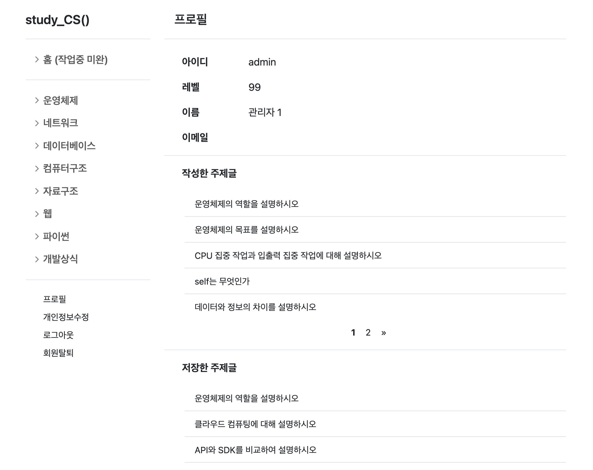
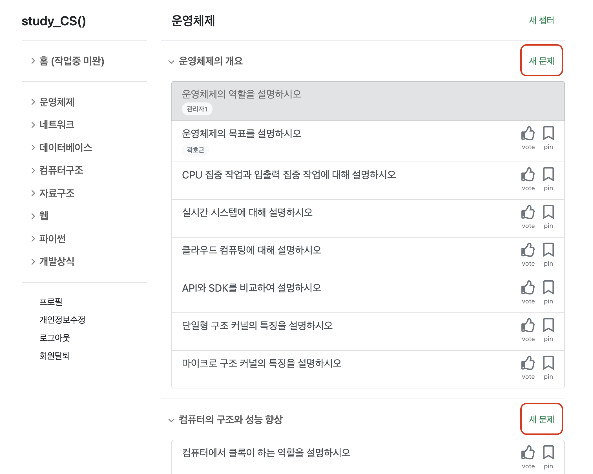
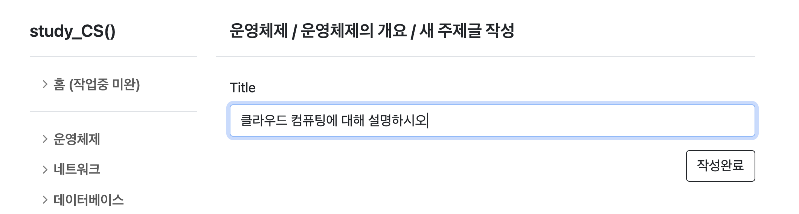
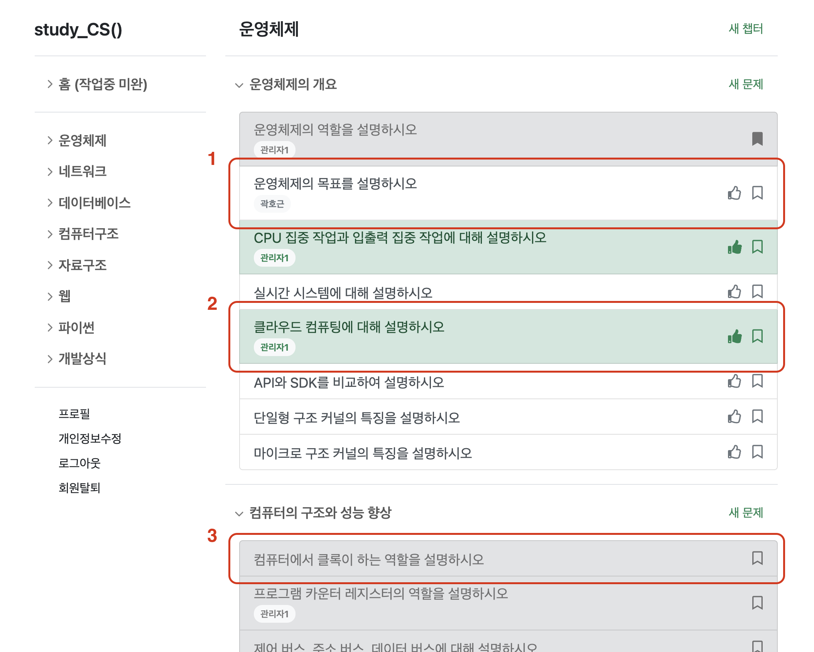
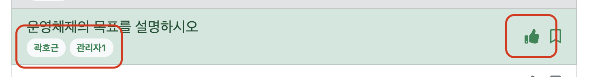
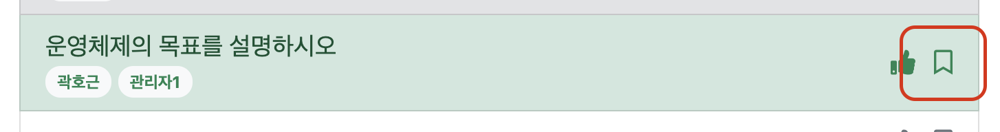
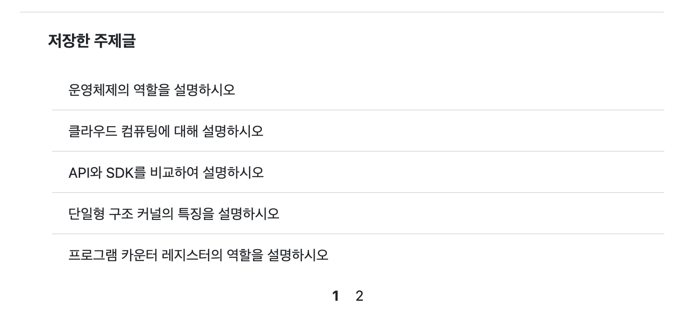

# CS 그룹 스터디 웹 애플리케이션

> written by Root_Kwak on April, 2021


## 0. CS 그룹 스터디 개요

* 부족한 CS 지식을 채우기 위해 운영체제/DB/네트워크/컴퓨터구조/프로그래밍언어 등을 공부하는 그룹 스터디입니다.
* 격주 마다 선정되는 4개의 주제글에 대해 각자 공부해 짧은 리포트를 작성해 공유 합니다.
* 원한다면 웹에 개시된 추가 주제글에 대해서도 공부할 수 있습니다.


## 1. 기능들

> 배포 URL : https://root-cs-vote.herokuapp.com/

### 1-1. 계정 생성과 로그인

* 사용자마다 고유한 활동 정보를 기록하도록 계정을 생성하고 로그인합니다.

> 1) 계정 생성과 로그인 버튼
>
> 
>
> 2) 로그인하면 확인할 수 있는 프로필 화면
>
> 

### 1-2. 과목과 하위 챕터마다 생성되는 주제글

* 해당 챕터 내용과 관련해 스터디할만한 가치가 있는 주제글을 추가합니다.

> 1) 챕터마다 추가되어 있는 주제글 목록과 게시글 작성 버튼
>
> 
>
> 2) 주제글 작성 화면
>
> 

### 1-3. 주제글 투표

* 좋은 주제글에 투표하면, 투표수 상위 4개까지 다음주 필수 주제글이 됩니다.
* 진도에 맞지 않는 주제글은 투표할 수 없는 비활성화 상태가 됩니다.

> 1) 주제글의 상태에 따라 색이 다르게 표시
>
> ​	1번. 투표하지 않은 글 = 흰색
>
> ​	2번. 투표한 글 = 초록색
>
> ​	3번. 투표 비활성화 글 = 회색
>
> 
>
> 2) "따봉" 버튼으로 투표하고, 주제글 하단에는 추천한 사람의 명단이 표시
>
> 

### 1-4. 주제글 저장

* 흥미로운 주제글은 저장해두면, 자신의 프로필에서 목록을 확인할 수 있습니다.

> 1) "책갈피" 버튼으로 저장
>
> 
>
> 2) 프로필의 저장 목록
>
> 

### 1-5. 리포트 작성 및 추천 (미완)

* 주제글에 자신의 리포트를 게시하고 다른 사람의 리포트를 추천합니다.
* 리포트는 마크다운 형식을 지원합니다.


## 2. 개발환경

* OS : macOS Big Sur
* Python : Python 3.8.6
* 라이브러리 항목은 requirements.txt 참고


## 3. 로컬 설치 방법

> 로컬에서 설치하려면 아래 방법을 순차적으로 실행하면 됩니다. (기본 로컬 서버 실행 주소 [127.0.0.1:8000](http://127.0.0.1:8000/))
>
> 외부 서버로 배포하려면 `$ python manage.py collectstatic` 및 사용하는 배포 서비스의 세부사항을 따르면 됩니다.

```bash
# 1. 가상환경 생성 및 실행
$ python3 -m venv venv
$ source venv/bin/activate

# 2. 라이브러리 설치
(venv)$ pip install -r requirements.txt

# 3. DB 마이그레이션 적용
(venv)$ python manage.py migrate

# 4. 장고 서버 실행
(venv)$ python manage.py runserver
```


fin.